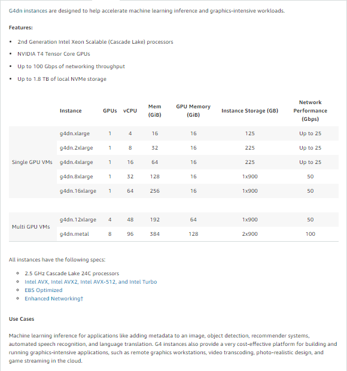
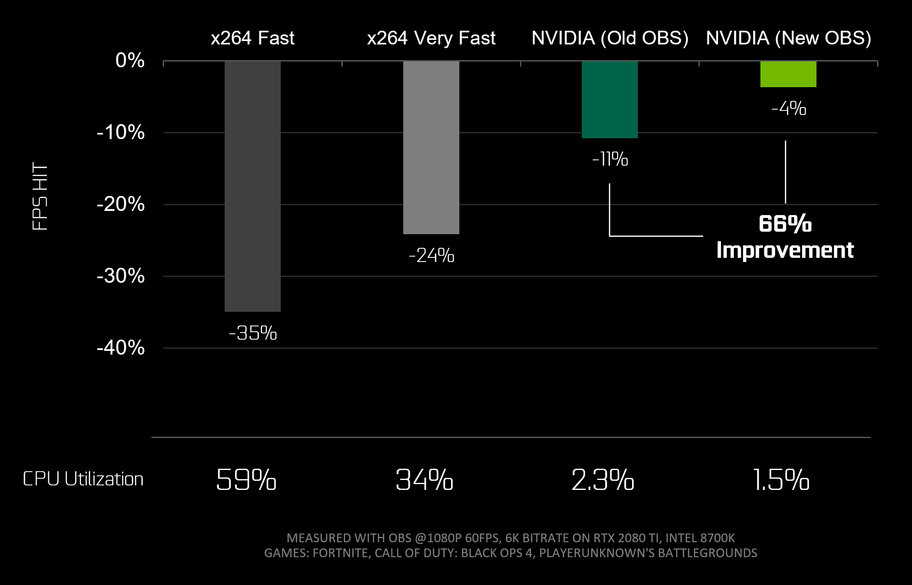

# The problem
During times of a pandemic, many have reverted to their desks at home not only for work, but also beyond it. All this started, as I tried to play CyberPunk 2077 🤖. Now, I'm not gamer, please don't judge me, but I do enjoy a good book, and sci-fi is my forte. So couldn't give this one a pass. The challenge was that I've quite a beefy rig, with 32GB DDR4 ram, and a 16-core XEON, with a measly Quadro k1200 😓. Even worse was trying on the [XBOX One X from last generation](https://support.cdprojektred.com/en/cyberpunk/xbox/sp-technical/issue/1763/my-game-crashes-8) constantly crashing.

☁ Cloud gaming has taken shape rapidly in 2020, behind the scenes with platforms such as Stadia, GeForce NOW, and even AWS launching [Luna](https://www.amazon.com/luna/landing-page). However, wide adoption is yet to be seen here in this subcontinent 🦘🪃, with us still relying on painfully slow NBN, and over expensive capped mobile 5G data. To add to the pain, the price of a relatively new GPU is to sell a kidney off, if they're even available in stores ! The Next-gen consoles, are all out of stock, and [scalpers](https://www.tomsguide.com/news/ps5-and-xbox-series-x-scalpers-ruining-restocks-what-you-can-do-now) are aiming for afr rich-list this year 💵.

# Solution
This post is about how we can use AWS to our rescue, and leverage gpu instances, albeit not originally designed for gaming, to the rescue. However, it wouldn't stop me from playing a game after almost a decade.

# Tools in my arsenal 🛠

## AWS G4dn EC2 Instance
[G4dn instances](https://aws.amazon.com/ec2/instance-types/g4/), `powered by NVIDIA T4 GPUs, are the lowest cost GPU-based instances in the cloud for machine learning inference and small scale training. They also provide high performance and are a cost-effective solution for graphics applications that are optimized for NVIDIA GPUs using NVIDIA libraries such as CUDA, CuDNN, and NVENC. They provide up to 8 NVIDIA T4 GPUs, 96 vCPUs, 100 Gbps networking, and 1.8 TB local NVMe-based SSD storage and are also available as bare metal instances.`

**Well Whatttt !!!**

From what I can say, the [T4 is half the performance of an RTX 2080](https://askgeek.io/en/gpus/vs/NVIDIA_GeForce-RTX-2080-vs-NVIDIA_Tesla-T4), still at the cost of the instances, it's a steal. Now the 2080 is not even remotely close to what I would love to have, i.e. a 3080/90, but at least ray tracing, and NVENC. I would come to the technical details of NVENC soon, and trust me it's important 🤔.

>These instances were clearly designed for machine learning, so I guess it's fair if they don't perform as amazing gaming rigs, spewing out unicorn vomit. But they still put out a fair fight, for the price, and no need to upgrade to a newer GPU/CPU/RAM every season.

## Parsec
I guess there's no point to argue over the almighty [Linus Tech Tips, when he's using this for his team to edit LTT videos](https://www.youtube.com/watch?v=B821HqH-dWI). Shhhh... I'm a nerd, and not advocating for the almighty. But once a birdie referred to me as "Brown Anthony" 🤎, and actually I was quite happy for it 😊.


***
The amazing thing about Parsec is the BUD protocol. Parsec uses its own peer-to-peer networking protocol called BUD; Better User Datagrams (naming is hard). BUD has been optimized for low-latency video delivery based on the data gathered over a three year period. With a 97% NAT traversal success rate and lightning fast adjustment to packet loss and congestion, BUD is the cornerstone of the Parsec SDK.


***
The basic setup for game streaming involves
>capture -> encode -> network -> decode -> render ->capture

## NVENC

Hardware plays a huge role in the performance of these connections. The most important part of that being the encoding latency of the video. Encoding latency is the amount of time it takes for the hardware on a GPU to compress a frame of video captured off of the GPU to prepare it to be shipped across the internet to the guest PC. Nvidia’s [NVENC](https://www.nvidia.com/en-au/geforce/news/geforce-rtx-streaming/) is approximately 2.59 times faster than AMD VCE and 1.89 times faster than Intel Quick Sync. The median encoding latency for an Nvidia card is 5.8 milliseconds; whereas, the median encoding latency on VCE is 15.06 milliseconds. This encoding latency is measured across all Co-Play sessions in Parsec, so there’s definitely a performance difference between newer generation cards than older generation cards, which we will examine in a future post.

The NVENC Encoder plays key role in the decision behind selection of the G4dn instance, considering it supports this feature. Parsec can not only use this, but also encode in H265 hardware-accelerated, as of now. This was ideally what I was looking for, and a win-win for this use case.

# My Setup - Terraform 🪄
As usual, I would've and would be automating the provisioning, so I ended up using my old friend Terraform for the job. Although, you probably can us any tools such as Pulumi / AWS CDK / CloudFormation, and possibly even AWS CLI 😜. I've uploaded the repo to github for reference and usage, it's well documented in-code for the curious one. However, the ultimate goal is yet to be achieved, fully automated provisioning.

**[github.com/debanjanbasu/instant-instance - Github Repo](https://github.com/debanjanbasu/instant-instance/)**

The setup involves simple steps of 

## 1. Initialize the tf backend - and the EC2 Instance

  1. `terraform init` Downloads the initial modules and all
  2. `terraform apply -auto-approve` Creates the backend.tf file with the config and the s3 bucket
  3. `terraform init -force-copy` Copies the local state to s3
  4. `terraform output instance_password` This is the generated Administrator password for the instance

## 2. RDP into the instance
Immediately as you RDP into the instance the automation kicks in, this is a deferred windows task to prepare the entire instance for gaming - SWEEEET 🤟.

It installs the following items automagically:

* Parsec
* Latest NVIDIA Grid Driver - with AWS License
* Razer Software - No need to register or login, this is for Audio Passthrough, and Gamepad compatibility
* The following tools optionally - via `variables` passed to the cloud-gaming-instance tf module
  * Steam
  * GOG Galaxy
  * UPlay
  * Origin
  * Epic Games Launcher

## 3. Configure The Instance

# Cost of Cloud Gaming on AWS
