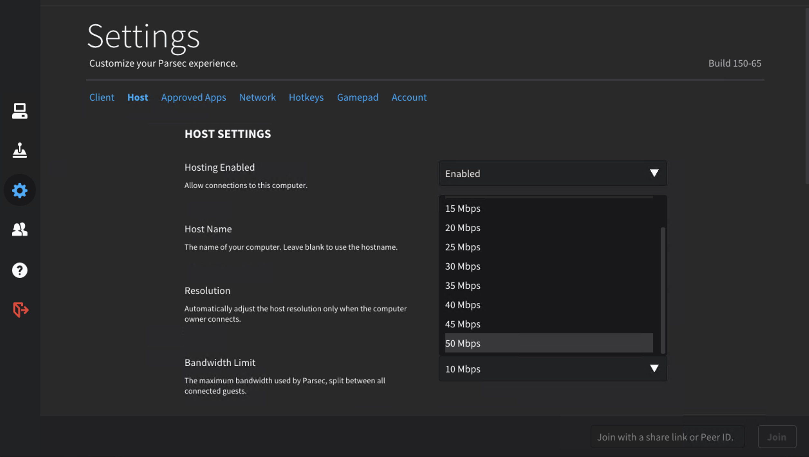
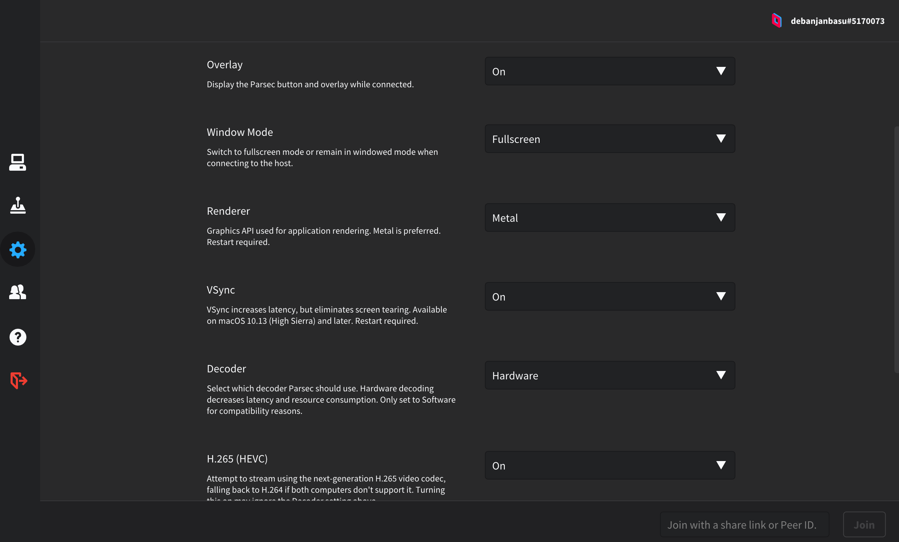

# The problem
During times of a pandemic, many have reverted to their desks at home not only for work, but also beyond it. All this started, as I tried to play CyberPunk 2077 🤖. Now, I'm not a "gamer", please don't judge me, but I do enjoy a good book, and sci-fi is my forte. So couldn't give this one a pass. The challenge was that I've quite a beefy rig, with 32GB DDR4 ram, and a 16-core XEON, with a measly Quadro k1200 😓. Even worse was trying on the [XBOX One X from last generation](https://support.cdprojektred.com/en/cyberpunk/xbox/sp-technical/issue/1763/my-game-crashes-8) constantly crashing.

☁ Cloud gaming has taken shape rapidly in 2020, behind the scenes with platforms such as Stadia, GeForce NOW, and even AWS launching [Luna](https://www.amazon.com/luna/landing-page). However, wide adoption is yet to be seen here in this subcontinent 🦘🪃, with us still relying on painfully slow NBN, and over expensive capped mobile 5G data. To add to the pain, the price of a relatively new GPU is to sell a kidney off, if they're even available in stores ! The Next-gen consoles, are all out of stock, and [scalpers](https://www.tomsguide.com/news/ps5-and-xbox-series-x-scalpers-ruining-restocks-what-you-can-do-now) are aiming for afr rich-list this year 💵.

# Solution
This post is about how we can use AWS to our rescue, and leverage gpu instances, albeit not originally designed for gaming, to the rescue. However, it wouldn't stop me from playing a game after almost a decade.

# Tools in my arsenal 🛠

## AWS G4dn EC2 Instance
[G4dn instances](https://aws.amazon.com/ec2/instance-types/g4/), `powered by NVIDIA T4 GPUs, are the lowest cost GPU-based instances in the cloud for machine learning inference and small scale training. They also provide high performance and are a cost-effective solution for graphics applications that are optimized for NVIDIA GPUs using NVIDIA libraries such as CUDA, CuDNN, and NVENC. They provide up to 8 NVIDIA T4 GPUs, 96 vCPUs, 100 Gbps networking, and 1.8 TB local NVMe-based SSD storage and are also available as bare metal instances.`

**Well Whatttt !!!**

From what I can say, the [T4 is half the performance of an RTX 2080](https://askgeek.io/en/gpus/vs/NVIDIA_GeForce-RTX-2080-vs-NVIDIA_Tesla-T4), still at the cost of the instances, it's a steal. Now the 2080 is not even remotely close to what I would love to have, i.e. a 3080/90, but at least ray tracing, and NVENC. I would come to the technical details of NVENC soon, and trust me it's important 🤔.


>These instances were clearly designed for machine learning, so I guess it's fair if they don't perform as amazing gaming rigs, spewing out unicorn vomit. But they still put out a fair fight, for the price, and no need to upgrade to a newer GPU/CPU/RAM every season.


## Parsec
I guess there's no point to argue over the almighty [Linus Tech Tips, when he's using this for his team to edit LTT videos](https://www.youtube.com/watch?v=B821HqH-dWI). Shhhh... I'm a nerd, and not advocating for the almighty. But once a birdie referred to me as "Brown Anthony" 🤎, and actually I was quite happy for it 😊.


***
The amazing thing about Parsec is the BUD protocol. Parsec uses its own peer-to-peer networking protocol called BUD; Better User Datagrams (naming is hard). BUD has been optimized for low-latency video delivery based on the data gathered over a three year period. With a 97% NAT traversal success rate and lightning fast adjustment to packet loss and congestion, BUD is the cornerstone of the Parsec SDK.


***
The basic setup for game streaming involves
>capture -> encode -> network -> decode -> render ->capture


## NVENC

Hardware plays a huge role in the performance of these connections. The most important part of that being the encoding latency of the video. Encoding latency is the amount of time it takes for the hardware on a GPU to compress a frame of video captured off of the GPU to prepare it to be shipped across the internet to the guest PC. Nvidia’s [NVENC](https://www.nvidia.com/en-au/geforce/news/geforce-rtx-streaming/) is approximately 2.59 times faster than AMD VCE and 1.89 times faster than Intel Quick Sync. The median encoding latency for an Nvidia card is 5.8 milliseconds; whereas, the median encoding latency on VCE is 15.06 milliseconds. This encoding latency is measured across all Co-Play sessions in Parsec, so there’s definitely a performance difference between newer generation cards than older generation cards, which we will examine in a future post.


The NVENC Encoder plays key role in the decision behind selection of the G4dn instance, considering it supports this feature. Parsec can not only use this, but also encode in H265 hardware-accelerated, as of now. This was ideally what I was looking for, and a win-win for this use case.

# My Setup - Terraform 🪄
As usual, I would've and would be automating the provisioning, so I ended up using my old friend Terraform for the job. Although, you probably can us any tools such as Pulumi / AWS CDK / CloudFormation, and possibly even AWS CLI 😜. I've uploaded the repo to github for reference and usage, it's well documented in-code for the curious one. However, the ultimate goal is yet to be achieved, fully automated provisioning.

**[github.com/debanjanbasu/instant-instance - Github Repo](https://github.com/debanjanbasu/instant-instance/)**

The setup involves simple steps of 

## 1. Initialize the tf backend - and the EC2 Instance

  1. `terraform init` Downloads the initial modules and all
  2. `terraform apply -auto-approve` Creates the backend.tf file with the config and the s3 bucket
  3. `terraform init -force-copy` Copies the local state to s3
  4. `terraform output instance_password` This is the generated Administrator password for the instance

## 2. RDP into the instance
Immediately as you RDP into the instance the automation kicks in, this is a deferred windows task to prepare the entire instance for gaming - SWEEEET 🤟.

It installs the following items automagically:

* Parsec
* Latest NVIDIA Grid Driver - with AWS License
* Razer Surround - No need to register or login, this is for Audio Passthrough
* The following tools optionally - via `variables` passed to the cloud-gaming-instance tf module
  * Steam
  * GOG Galaxy
  * UPlay
  * Origin
  * Epic Games Launcher


## 3. Configure The Instance
The instance is pretty much pre-configured with the minimal intervention.

### 1. Parsec Login
You would still need to login into your Parsec account, and verify the confirmaiton email 📩, as a new machine is being joined to the network.


### 2. Ignore / Login into Razer Surround
Either login / do nothing 🙃.


### 3. Setup Ephimeral Storage as Game Disk / Cache
These instances do come with high-speed Ephimeral Storage, so why not use it to download or as a game-cache. Simply open up the Disk Partition Utility to initialize this disk, or for advanced users [EC2 Launch v2](https://docs.aws.amazon.com/AWSEC2/latest/WindowsGuide/ec2launch-v2-overview.html) (the selected image comes pre-built with this beauty).


### 4. Increase Parsec Bitrate (Optional)
If you've got a good internet connection, why not increase the maximum bitrate, this can be increased even more from a manual config. I would recommend 100MBps custom config, for NBN users on 100MBps plans. Be careful though, if you're not on Unlimited bandwith.



### 5. Setup Shutdown on Idle & 1 hour notice (Optional)
These are nifty scripts (located conveniently on the desktop) to shutdown the instance on Idle, and to notify the gamer, when 1 hour of gaming is about to be reached (EC2 instances are billed hourly).


### 6. Overclocking & NVIDIA OpenGL RDP (Optional but highly recommended)
* What's gaming, without a bit of overclocking! Fortunately the G4dn instances do support nvsmi tool. Use the following in PowerShell to configure it:

  ```powershell
  cd "C:\Program Files\NVIDIA Corporation\NVSMI"
  .\nvidia-smi --auto-boost-default=0
  .\nvidia-smi -ac "5001,1590"
  ```
  There's a [powershell script in the repo](https://github.com/debanjanbasu/instant-instance/blob/main/overclock-gpu.ps1) to automate this too.

  NVIDIA has created a special tool for GeForce GPUs to accelerate Windows Remote Desktop streaming with GeForce drivers R440 or later.

* Download and run the [executable](https://developer.nvidia.com/nvidia-opengl-rdp) (nvidiaopenglrdp.exe) from the DesignWorks website as Administrator on the remote Windows PC where your OpenGL application will run. A dialog will confirm that OpenGL acceleration is enabled for Remote Desktop and if a reboot is required.

  You would need to hold an nvidia developer account, or create one for free.

### 7. Client Machine Parsec Settings (Optional but highly recommended)
Parsec does support hardware accelerated decoding on the client machine too. If your pc supports **H.265**, possibly the best, but **H.264** doesn't lag behind too much. Ensure these options are checked to get the best possible results.



### 8. Custom Resolution Utility (Optional but highly recommended)
Parsec does support up-to 4k natively without any issue, but I do happen to have a super-ultrawide gaming monitor. So why not get gaming at those exceptional aspect ratios. Unfortunately, the NVIDIA driver provided by AWS doesn't allow for custom resolution changes. The workaround is to use this sweet tool called [Custom Resolution Utility](https://www.monitortests.com/forum/Thread-Custom-Resolution-Utility-CRU).
Fire it up, and you can add any custom resolutions, or directly export and import form your client machine, easy.

# Cost of Cloud Gaming on AWS
The infrastructure provisioned is already highly optimized, but can be improved further. The cost depends on your region and the type of instance you are using but AWS’ scalable platform allows individuals to create a cloud gaming setup inexpensively. If you wanted to keep the prices as low as possible, you can use a spot Amazon EC2 instance. What spot pricing allows you to do is bid on unused Amazon EC2 instance at a significant reduced rate. Roughly 1/7th the regular cost than regular instances. However, costs vary depending on the region, and prices will also reflect the demand of these spot instances. By comparison, on-demand instances have a fixed rate that won’t fluctuate based on demand unless Amazon changes them.

Some sample data for reference are (based on Sydney Region):

| GPU Instances - Current Generation                   	|                  	| Cost / month 	|
|------------------------------------------------------	|:----------------:	|--------------	|
| g4dn.xlarge (10 hours of gaming/week)                	| $0.3892 per Hour 	| $15.57       	|
| Snapshot Storage Cost (1% change, as you play daily) 	|       128GB      	| $9.13        	|
| Total (per month)                                    	|                  	| $24.70       	|

Not bad for **$24.70 for a month**, gaming at maximum settings 60FPS with Ray-Tracing 🌈. There are competing services elsewhere, but this allows for any games to be played, with BYOL licensing, greatly reducing the overall cost.

> The cost of Cyberpunk 2077 on launch day itself was $100 😅

You’ll need to use some disk space for the Amazon EC2 instance. Whenever you decide to spin up an Amazon EC2 instance, you base the instance on an AMI (Amazon Machine Image). The AMI will already be pre-configured with a Windows install and will be copied to a general-purpose (gp3) Amazon EBS storage (Elastic Block Store). Whenever you terminate the instance, the Amazon EBS storage is deleted with it, and a snapshot created for it. The price for this storage depends on the region you are in.

The cost settings for the infra is can be controlled from this bit in terraform from the `main.tf` file, and the amount from [AWS spot historical data](https://aws.amazon.com/ec2/spot/pricing/).

```terraform
module "instant_instance" {
  ...
  instance_type   = "g4dn.2xlarge"
  instance_name   = local.instance_name
  # Check pricing from https://aws.amazon.com/ec2/spot/pricing/
  # TODO - Automate in the future
  spot_max_price = 1.0
  # IMP - Please install the tools and all in the first time
  skip_install = false
  ...
}
```

To achieve maximum cost optimization, the disks are terminated immediately on shutdown. There is [automation also to create the AMI and cleanup of previous one](https://github.com/debanjanbasu/instant-instance/blob/main/create-ami-ssm-shutdown.ps1), for playing again. 

```powershell
$InstanceId=(Invoke-WebRequest -Uri 'http://169.254.169.254/latest/meta-data/instance-id').Content

# Run the automation job
aws ssm start-automation-execution --document-name "image-reimage" `
    --parameters InstanceId=$InstanceId
```

You can either execute this from within the instance, or from your local environment, or even as terraform `local-exec`.

# TODOs and future plans (Conclusion)

1. Automate the retrieval of Spot Instance price
2. Send a push notification to the user's device before spot termination
3. Automate offloading of games to S3
5. Automate activation of Parsec Account if possible
6. Build a custom Parsec-SDK based client

As of now, this is one of the best ways to enjoy game streaming in Australia, until GeForce Now launches down under 😭🇦🇺. Thereafter, the cost of the games themselves might balloon the overall cost eventually. Trust me, this happens more often than we realize with subscription based services.

My future goal is to completely automate this provisioning, and allow anyone with an AWS account to be able to just enter their access-key to spin up an Instant Cloud Gaming Instance immediately.

Please feel free to reach out to me for further clarification, to get your setup up and running. It might sound complex, but tust me it's worth it 😅. Always open to advice, and improvements.

Reach out to me from any of the channels below....

👇
